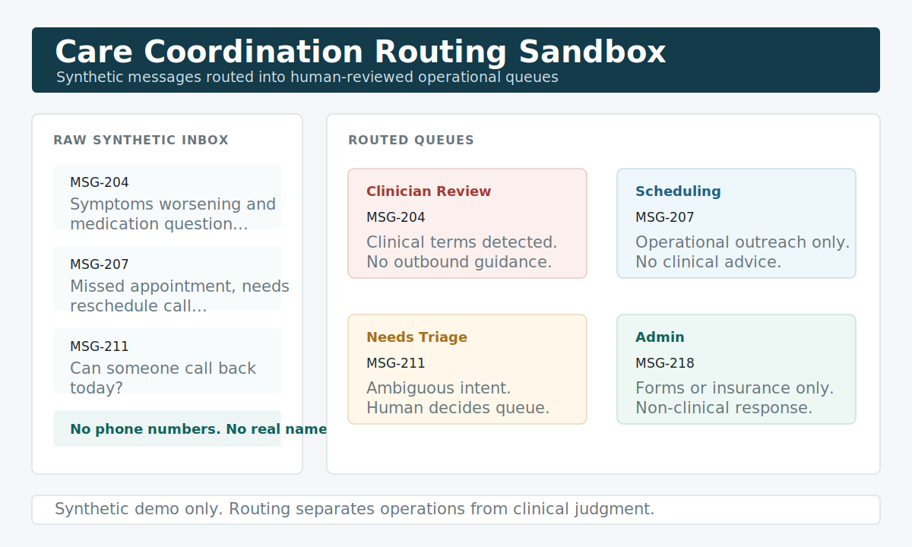

# WhatsApp Care Coordination Sandbox

Synthetic care-team message routing demo for healthcare operations.

This project demonstrates how a lightweight AI-assisted routing layer can turn unstructured team messages into human-reviewed queues: missed visit outreach, refill routing, lab follow-up, scheduling barriers, and escalation review.



The visual demo shows how synthetic messages move from a raw inbox into clinician-review, scheduling, admin, and needs-triage queues.

## What It Shows

- Synthetic message fixtures with no phone numbers or real identities.
- Rule-based routing that mirrors the structure an AI classifier could support.
- Human-review guardrails for clinical, urgent, or ambiguous messages.
- A simple queue output that separates operational tasks from clinician review.

## Recruiter Quick Scan

This repo demonstrates healthcare operations thinking more than chat-app mechanics. The interesting part is the routing boundary: which messages can become operational tasks, which must go to a clinician, and which are too ambiguous to automate.

Why it matters: care-team messaging can become a hidden clinical risk surface. A useful AI workflow should reduce missed follow-up while refusing to generate clinical advice without review.

## Safety Boundary

This is a synthetic demo. It contains no real messages, no patient identifiers, no phone numbers, and no production care-team data. It should not send messages, make clinical decisions, or replace clinician judgment.

## Run The Demo

```bash
python3 examples/run_demo.py
```

See `examples/demo-output.txt` for a captured example run.

See `docs/triage-examples.md` for concrete examples of how mixed operational and clinical messages should be routed.

## Project Structure

```text
synthetic-data/messages.json  synthetic message examples
src/message_router.py         routing logic
docs/routing-policy.md        human-review policy
examples/run_demo.py          runnable demo
```

## Next Build Ideas

- Add a synthetic CSV/JSONL inbox import.
- Add confidence scores and an `ambiguous` queue.
- Add a dashboard view for queue ownership.
- Add tests that verify clinical terms always route to clinician review.
